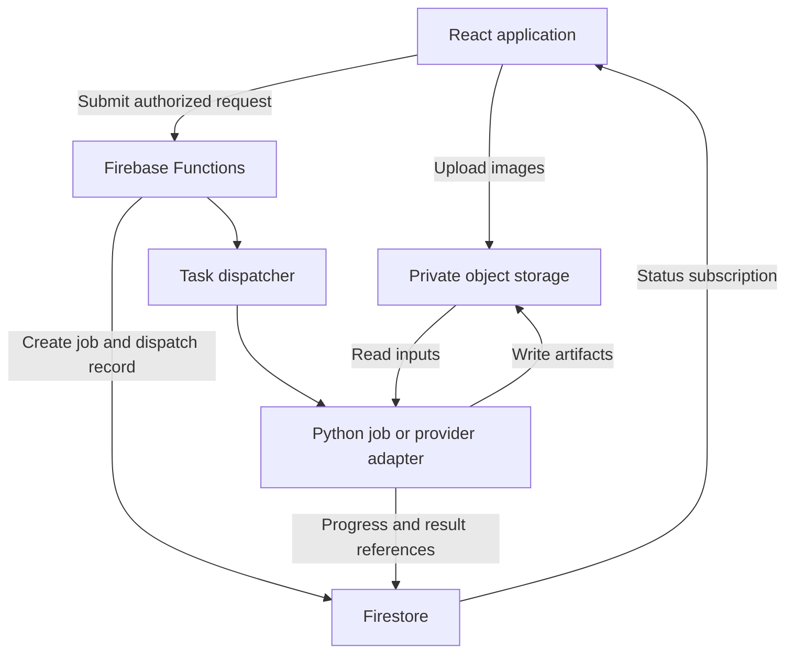

# Image-to-3D application: implementation plan

Version 1.0 · September 8, 2026

Status: proposed build specification. No application, cloud resources, paid jobs, or calibration assets have been deployed or created by this planning task.

## 1. Product objective and boundaries

Build a React application backed by Firebase that accepts photographs from a DSLR, Android phone, iPhone, or other camera; converts them into inspectable 3D data; and exports common files for downstream analysis and modeling.

Primary interaction: **upload → reconstruct → inspect → export**.

Start as a conversion and inspection workspace, not a complete CAD editor. Favor a usable, traceable result over a visually complete result that hides uncertainty.

### Three distinct modes

| Mode | User-facing label | Method | What the output means |
| --- | --- | --- | --- |
| Single-photo depth | Estimated visible surface | Depth inference followed by camera-ray back-projection | A partial, inferred surface; not a measured scan |
| Multi-photo reconstruction | Multi-photo scan | Feature matching, camera estimation, triangulation, dense reconstruction | Geometry supported by multiple photographed views; still subject to errors and missing areas |
| Generative completion, optional | AI-generated model | Dedicated image-to-3D generation provider | Plausible geometry, including invented unseen surfaces |

Do not silently switch between these modes. If reconstruction fails, show the failure and offer alternatives explicitly. A PLY sampled from a generated mesh remains generated data.

### Release boundaries

| Release | Included | Deferred |
| --- | --- | --- |
| A: working conversion MVP | JPEG/PNG uploads, one-photo depth, colored PLY, partial OBJ/GLB mesh, viewer, provenance, private projects, asynchronous jobs | Calibration, full-object scanning, chat assistant |
| B: reference-assisted scanning | Printable SVG board, camera profiles, multi-photo scans, scale validation, scan-quality inspection | Precision certification, advanced CAD operations |
| C: optional extensions | Generative completion, AI guidance, additional input formats, richer analysis | Features are selected from actual usage, not all built together |

Initial assumptions: one stationary, opaque object per scan; diffuse lighting; tabletop-scale subjects; private individual accounts; uploaded files rather than DSLR remote control. These defaults are editable product choices, not limitations on the eventual architecture.

Neither single-image depth nor a calibration board guarantees millimeter accuracy. Do not label outputs suitable for safety-critical inspection, manufacturing tolerances, or reliable volume measurement without a separate validation program.

## 2. Core technology decisions

### Recommended stack

| Layer | Proposed implementation | Responsibility |
| --- | --- | --- |
| Web application | React, TypeScript, Vite | Screens, uploads, controls, project state |
| 3D view | `three`, `@react-three/fiber`, `@react-three/drei` | Point clouds, meshes, cameras, picking, overlays |
| Client metadata | `exifr` | Read available EXIF; never assume metadata is present |
| Web delivery | Firebase Hosting | Static application delivery |
| Identity | Firebase Authentication | User identity |
| Project database | Firestore | Metadata, job status, revisions, artifact references |
| Object storage | Cloud Storage for Firebase | Images, arrays, models, calibration files |
| API/control layer | Second-generation Firebase Functions, TypeScript by default | Authorization, validation, dispatch, quotas, results |
| Queue | Cloud Tasks / Firebase task queue functions | Short dispatch and status-check work, bounded retries |
| Geometry worker | Versioned Python container launched as a Cloud Run Job | Inference, reconstruction, conversion, artifact validation |
| Geometry libraries | NumPy, OpenCV, Open3D, trimesh, PyTorch, COLMAP/PyCOLMAP as needed | Numerical work, not conversational reasoning |
| Optional assistant | One provider adapter for OpenAI, Grok, or Google | Guidance and validated tool requests |

React Three Fiber wraps Three.js for React. Pin mutually compatible React/Fiber major versions rather than copying an arbitrary install command. [React Three Fiber project](https://github.com/pmndrs/react-three-fiber)

Firebase also supports Python Functions. Keeping TypeScript for the control layer and Python for geometry is a proposed separation of responsibilities, not a platform requirement. Light calibration or preprocessing may run in a Python Function if dependency size, memory, and measured runtime fit. [Firebase function configuration](https://firebase.google.com/docs/functions/manage-functions)

### Reconstruction backend choices

1. **First depth candidate:** evaluate Depth Anything 3 Small or Base with predicted camera parameters; keep the model behind an adapter. Its main-series outputs include depth and camera estimates. Small/Base are listed as Apache 2.0, while several larger checkpoints have noncommercial restrictions. Recheck the exact weights and dependencies before shipping. Metric-depth variants are separate choices and require correct focal-length handling. [Depth Anything 3 model cards and API](https://github.com/ByteDance-Seed/Depth-Anything-3)
2. **Multi-photo baseline:** COLMAP, using a pinned CLI/container build and PyCOLMAP only for the operations that actually need Python integration. Do not assume a pip installation alone supplies a working GPU-enabled dense pipeline. [COLMAP tutorial](https://colmap.github.io/tutorial.html)
3. **Optional whole-object generation:** Meshy is a concrete candidate with task-based image input and OBJ/GLB outputs. Benchmark separately; do not make it the hidden fallback for analysis mode. [Meshy image-to-3D API](https://docs.meshy.ai/en/api/image-to-3d)

Avoid building three LLM integrations or two competing photogrammetry stacks at the beginning. Establish a provider-neutral contract, then implement one backend per necessary mode.

### Hosting boundaries

Cloud Run Jobs can run GPU-backed containers, subject to region and quota. Current documentation limits a GPU task to one hour; the longer non-GPU task limit must not be mistaken for a GPU limit. Benchmark within this bound and checkpoint stages. If real datasets exceed it or need substantially more scratch capacity, assess a different batch/VM execution backend before widening scan limits. [Cloud Run task timeouts](https://docs.cloud.google.com/run/docs/configuring/task-timeout), [GPU job configuration](https://docs.cloud.google.com/run/docs/configuring/jobs/gpu)

The browser must never upload full image batches through a callable Function or wait for reconstruction inside one HTTP request. Upload directly to Storage, submit artifact IDs, and return a job ID quickly.

## 3. System architecture and execution flow



This is a proposed topology. Queue dispatch and result publication need explicit reliability logic; the arrows do not imply a cross-service transaction.

### Job lifecycle

Use `queued`, `dispatching`, `running`, `finalizing`, `succeeded`, `failed`, and `cancelled`. Store `cancelRequested` separately until cancellation is confirmed. Within `running`, report a named stage such as `preprocess`, `estimate_depth`, `match_images`, `solve_cameras`, `fuse`, or `mesh`.

1. The client creates a private project and uploads files into assigned input slots.
2. A finalize-input operation validates actual file signatures, decoded size, ownership, and immutable Storage generation references.
3. The client submits mode, validated input IDs, settings, optional calibration profile, and an idempotency key.
4. The API authorizes everything server-side and transactionally records the job, budget reservation, and an outbox/dispatch record.
5. A dispatcher claims the record, launches a worker or provider task, and retains its external execution ID.
6. A worker claims an attempt lease before expensive processing. A fencing token prevents stale attempts from publishing results.
7. Processing writes into an attempt-specific output prefix and periodically reports real stage progress.
8. A finalizer checks artifact integrity and ownership, then publishes a manifest and the successful artifact references together in Firestore.
9. The UI loads a lightweight preview; full-resolution exports remain separate downloads.
10. A reconciler handles jobs stuck between creation, launch, and completion. It must not blindly relaunch an ambiguously submitted paid provider request.

Functions and task queues support retry controls; retry-safe side effects are an application responsibility. [Firebase task queues](https://firebase.google.com/docs/functions/task-functions), [Firebase idempotency guidance](https://firebase.google.com/docs/functions/retries)

### Failure rules

- Retriable: temporary network errors, provider rate limits, recoverable worker interruption.
- Non-retriable without input changes: unsupported file, invalid calibration, insufficient views, repeated memory exhaustion at the same settings.
- Unknown provider submission: reconcile using provider capabilities; if no reliable lookup or idempotency mechanism exists, mark for review instead of risking another charge.
- Cancellation: stop between stages where possible; kill an owned worker execution when supported. A provider without cancellation can finish in the background, but the app must suppress publication and disclose that charges may remain.
- Never show `succeeded` until promised output files exist and pass validation.

## 4. Camera-ray and geometry contract

### What is and is not ray tracing

The reconstruction system uses camera rays, depth back-projection, and multi-view triangulation. Rendering rays that simulate light and reflections are a separate optional preview feature. The MVP uses a standard real-time Three.js view.

For an undistorted pinhole image with pixel coordinate `(u, v)`, camera matrix `K`, and optical-axis depth `z`:

```text
p_camera = z * inverse(K) * [u, v, 1]^T
```

If a model returns distance along a normalized viewing ray instead, the adapter must use that convention. Relative depth, inverse depth, and metric depth are not interchangeable. Never back-project a colorized depth-preview PNG. [Open3D depth-to-point-cloud definition](https://www.open3d.org/docs/0.19.0/python_api/open3d.geometry.PointCloud.html)

### Required conventions

- Keep camera calculations in a documented right-handed camera frame: x right, y down, z forward.
- Store each pose explicitly as world-to-camera or camera-to-world; use names such as `T_world_from_camera` rather than an ambiguous `pose` field.
- For a single image, its camera frame can be the reconstruction frame. For multi-photo output, retain the solver frame and a separately recorded alignment transform.
- Apply one tested transform for a Y-up viewer/export frame. Transform cameras, normals, landmarks, annotations, and geometry consistently; test handedness and triangle winding.
- Store `metersPerUnit` as null when physical scale is unknown. Unknown units must remain visible even if the viewer normalizes the object for display.
- When exporting an unscaled GLB, record the arbitrary normalization in metadata and the accompanying manifest; do not imply that its nominal file units are measured physical dimensions.
- Track EXIF orientation, resize, crop, padding, and undistortion transforms. Intrinsics must refer to the exact image used by the worker.
- Keep the model-native depth array and an explicit `depthConvention`; save derived numerical depth separately from display images.
- If distortion is corrected, record the new camera matrix. Do not undistort twice or apply old intrinsics to a cropped image.
- A focal length in millimeters from EXIF alone is not a complete camera calibration. Prefer a matching profile, a validated conversion with known sensor/crop geometry, or explicitly labeled estimated intrinsics.

### Single-image processing stages

Validate and orient the image; create a traceable working copy; estimate depth and available camera parameters; convert through the backend adapter; remove invalid samples; apply a user-approved mask; back-project; attach sampled RGB; save original and filtered point-cloud revisions.

For the first mesh, connect neighboring valid depth samples into triangles and reject edges across large depth discontinuities. This produces an intentionally open, partial surface. Tune thresholds against fixtures; do not fill the back of the object automatically.

### Multi-image processing stages

Use overlapping views to match features, solve camera poses and sparse structure, refine the solution, compute/fuse dense geometry, and construct a mesh. Record camera registration failures and disconnected components; do not force separate components together without evidence. The COLMAP pipeline provides the baseline implementation. [COLMAP reconstruction workflow](https://colmap.github.io/tutorial.html)

Use masks consistently, reject implausible matches, and preserve the sparse reconstruction, camera solution, and dense artifacts as distinct products. Similar reprojection error does not imply similar physical accuracy.

## 5. Calibration and SVG reference-board design

Calibration is optional for Release A and a dedicated workflow in Release B. Separate **lens calibration**, **scan alignment**, and **physical scale** in both code and UI.

Proposed printable design: a standard ChArUco board with 5 by 7 squares, 25 mm square sides, 17.5 mm markers, and `DICT_4X4_50`. The board area is 125 by 175 mm. Produce Letter and A4 page variants with identical board geometry, adequate white margins, a separate 100 mm size-check line, and the board ID/version. These are design defaults to validate, not an existing generated asset.

Generate exact SVG rectangles from the chosen OpenCV dictionary and board layout. Do not hand-invent marker bit patterns or use an image-generation model. Derive SVG and machine-readable board metadata from the same canonical definition; retain marker IDs, corner coordinates, units, dimensions, OpenCV version, and layout hash.

OpenCV supports ChArUco calibration using views from different positions and recommends its chessboard corners for accurate localization. [OpenCV ChArUco calibration](https://docs.opencv.org/4.x/da/d13/tutorial_aruco_calibration.html)

### Calibration workflow

1. Download the correct page-size SVG and print at actual size, without fit-to-page.
2. Measure the size-check line; reject or regenerate prints with material scaling errors. Keep the board flat on a rigid matte backing.
3. Capture a proposed starting set of 15–25 sharp board images covering different tilts, positions, and image edges.
4. Detect corners, visualize detections, reject blurred/degenerate views, and solve intrinsics and distortion.
5. Report per-view residuals, image coverage, and held-out validation; never turn the calibration residual alone into an object-accuracy claim.
6. Save a profile tied to camera/lens, focal setting, image dimensions, crop, and relevant focus/processing configuration. Warn on mismatches and phone lens switching.

### Using the board in a scan

Keep the board rigid relative to the object across the relevant views. Reconstruct known board landmarks and fit a robust similarity transform to board coordinates; use independent known distances to validate scale. A turntable that moves the object while leaving the board fixed needs a different capture/masking strategy and is deferred initially.

One board photo can support planar mapping and, with known intrinsics, pose estimation. It cannot fully calibrate an arbitrary lens or reveal off-plane object depth. Applying one scale factor to a distorted AI depth estimate does not repair its shape.

Acceptance tests: machine-detect the generated SVG after rasterization and perspective warps; check IDs and dimensions against the canonical metadata; test actual prints; reject wrong board versions; verify profile mismatch warnings and scale checks.

## 6. Data model and internal interfaces

These names are proposed application contracts, not Firebase SDK method names.

### Firestore records

| Record path | Key fields |
| --- | --- |
| `users/{uid}` | Display settings and user preferences; server-owned quota fields protected separately |
| `projects/{projectId}` | `ownerId`, name, timestamps, archive state, active reconstruction revision |
| `projects/{projectId}/images/{imageId}` | Owner, original/working Storage references, object generation, checksum, dimensions, orientation transform, camera grouping, validation state |
| `projects/{projectId}/jobs/{jobId}` | Mode, immutable inputs, settings, state, stage, attempt/fencing token, lease, external execution ID, error, cancellation, output manifest reference |
| `projects/{projectId}/artifacts/{artifactId}` | Kind, Storage reference, checksum, byte size, source job, parent artifact IDs, provenance, units, revision |
| `projects/{projectId}/measurements/{measurementId}` | Artifact revision, selected points, result, units, scale status, uncertainty note |
| `cameraProfiles/{profileId}` | Owner, camera signature, K, distortion model/coefficients, resolution, capture settings, validation report, board definition version |
| `jobDispatch/{dispatchId}` | Server-only outbox state, job reference, lease, attempts, next check time |
| `usageReservations/{reservationId}` | Server-only owner, job reference, reserved allowance, reconciled usage and status |

Do not put millions of vertices or image bytes into Firestore. Use small documents with references to binary artifacts. Clients may edit allowed project labels and preferences; only trusted backend code may set job results, processing provenance, charges, or validated input state.

### Object storage layout

| Proposed prefix | Contents |
| --- | --- |
| `users/{uid}/projects/{projectId}/inputs/{imageId}/` | Immutable original plus derived working images |
| `users/{uid}/projects/{projectId}/jobs/{jobId}/attempts/{attemptId}/` | Attempt-specific depth, masks, cameras, sparse/dense results, temporary exports |
| `users/{uid}/projects/{projectId}/artifacts/{artifactId}/` | Published immutable artifacts and manifests |
| `users/{uid}/camera-profiles/{profileId}/` | Calibration inputs and reports |

Disallow overwriting an input generation after validation. Derive authorization from the authenticated identity and stored ownership, not from the `uid` embedded in a client-supplied path.

### Artifact manifest

Every downloadable result should have a small JSON manifest containing:

- `schemaVersion`, `artifactId`, `jobId`, creation timestamp.
- Source image IDs, immutable generations/checksums, preprocessing transforms.
- Engine name, exact model/checkpoint or provider version when available, container digest, settings.
- `provenance`: `single_image_estimated`, `multiview_reconstructed`, `generative`, or an explicitly labeled mixed derivative.
- Geometry type, vertex/point/face counts, coordinate frame, transform history.
- `scaleStatus`: `unknown`, `model_estimated`, `user_scaled`, or `reference_scaled`; `metersPerUnit` where meaningful.
- `depthConvention`, intrinsics/pose source, camera-file reference where applicable.
- Filtering, meshing, hole filling, decimation, and sampling operations.
- Per-engine quality indicators and separate validation results; missing values stay null.
- File names, formats, sizes, checksums, and warnings.

Do not manufacture a global “95% accurate” score. A model confidence map is not a calibrated probability of geometric correctness. Multi-view view counts and residuals are useful evidence, but not substitutes for independent physical measurements.

### Public application operations

| Operation | Input | Result |
| --- | --- | --- |
| `createProject` | Name | Project ID and permitted upload prefix |
| `finalizeInputs` | Project ID, uploaded input references | Validated image IDs or per-file errors |
| `submitReconstruction` | Project, image IDs, mode, settings, optional profile, idempotency key | Job ID; never a synchronously generated mesh |
| `requestCancel` | Job ID | Cancellation-request status |
| `createArtifactRevision` | Parent artifact, approved crop/filter/transform operations | New revision or processing job |
| `requestExport` | Artifact revision, format, explicit transform/unit options | Existing export reference or export job ID |
| `requestCalibration` | Board definition, validated images, capture signature | Calibration job ID |
| `getDownload` | Artifact ID | Authorized short-lived download capability |

Status reads use a Firestore listener or an authenticated equivalent. Signed downloads must not be logged or shared accidentally. Large exports should stream/download without being loaded into a mobile viewer first.

### Processing adapter contract

Keep a backend interface with `capabilities`, `submit`, `status`, `cancel`, and `collect`. Capabilities declare supported image counts, input formats, mesh/point-cloud outputs, scale behavior, and actual cancellation support. Separate job transport from geometry conversion so local development and Cloud Run can share numerical code.

Validate contracts in TypeScript and Python using a shared, versioned JSON Schema and fixture tests. Avoid maintaining two subtly different handwritten definitions.

## 7. User interface blocks

| Screen or panel | Minimum behavior |
| --- | --- |
| Project list | Create, reopen, archive; thumbnail and latest result state |
| Capture/upload | File selection, upload progress, image thumbnails, exclusions, actionable format errors |
| Reconstruction setup | Clear mode choice, expected limitations, optional profile, estimated resource/cost category |
| Processing | Real stage, elapsed time, errors, cancellation request; survives refresh |
| Inspection workspace | Original image, depth preview, 3D view, result properties |
| Calibration wizard | Printable board, photo collection, corner overlays, profile validation |
| Export panel | Geometry kind, format, units/scale status, coordinate transform, provenance notice |

The viewer needs orbit/pan/zoom, reset view, point size, mesh/wireframe toggles, background color, axes, and optional camera-frustum overlays. Grid labels must show arbitrary units when scale is unknown. Add a reduced-detail preview path and dispose of GPU resources when changing projects.

First editing tools: box crop, point selection/removal, basic outlier filtering, rotation, and explicit scaling. Use revision history and undo; originals remain unchanged. Defer sculpting, booleans, retopology, and a full modeling timeline.

Show distance measurements only with the artifact's scale status. For an open single-view surface, disable whole-object volume. Do not infer printability merely because STL export succeeds.

## 8. Export and analysis contract

| Format | Intended use | Planned handling |
| --- | --- | --- |
| PLY | Colored point cloud; optionally triangle mesh | Primary analysis format; explicitly identify which geometry type is present |
| OBJ | Broad mesh interchange | First mesh export; package MTL/textures when used, with a manifest |
| GLB | Convenient viewer/interchange mesh | Single-file mesh preview/export; verify geometry type, transforms and scale metadata |
| NPZ | Numerical analysis bundle | Depth arrays, masks, available confidence, camera parameters; numeric arrays only, no pickle-dependent objects |
| JSON | Provenance and camera/coordinate metadata | Included with all export bundles |
| XYZ, later | Simple point coordinates | Warn that color, normals, units and metadata may be lost |
| STL, later | Geometry-only printing workflow | Explicit units; run mesh checks; no automatic guarantee of watertightness or printability |

Open3D handles point-cloud geometry; trimesh provides mesh analysis and common exporters. Format conversion does not recover missing geometry or improve measurement accuracy. [Open3D point-cloud API](https://www.open3d.org/docs/0.19.0/python_api/open3d.geometry.PointCloud.html), [trimesh capabilities](https://trimesh.org/)

For Release A, geometry-only OBJ is acceptable; vertex-colored PLY retains appearance. Add texture-aware OBJ packaging only after geometry round-trip tests pass. A GLB containing points must not be described as a triangle mesh.

## 9. Phased work packages and acceptance gates

The effort labels below are relative planning estimates, not calendar commitments. Time and cost targets become credible only after the first benchmark. Security, provenance and observability begin with the foundation; the later hardening block expands their tests.

### Block 0 — Prove the geometry path first

Effort: medium. Dependency: none.

- Assemble approximately 10 representative test objects with permitted photos: textured objects, curved shapes, a thin object, and difficult shiny/low-texture examples.
- Collect one-photo inputs plus a smaller multi-view test set; record some independent physical dimensions.
- Run one chosen depth backend in a local or explicitly approved test worker.
- Export numerical depth, camera metadata, a colored PLY, and one simple partial mesh.
- Inspect in an independent viewer and record runtime, peak RAM/VRAM, cold start, files sizes and visible failures.
- Decide whether the selected backend is useful for the actual objects. Keep generated whole-object models in a separate experiment if evaluated.

Gate: a reproducible command produces a usable PLY/partial OBJ and a truthful report from real input. If it does not, fix or replace the engine before building the complete UI. No fake depth based on image brightness, random points, or unrelated demo meshes.

### Block 1 — Application and asynchronous-job foundation

Effort: medium. Dependency: the Block 0 artifact contract.

- Create the React/TypeScript shell, private projects, direct uploads, and a basic viewer that can open Block 0 fixtures.
- Implement Firestore/Storage rules, backend ownership checks, validated inputs and secret handling.
- Add submit/status/cancel operations, outbox dispatch, attempt leases, structured errors, and tracing by job ID.
- Use a clearly labeled test-only worker for queue tests; do not expose fixtures as reconstructions.

Gate: authorized users upload and reopen projects; cross-user access fails; refresh preserves job status; duplicate submissions reuse the same job and do not create duplicate published artifacts.

### Block 2 — Single-photo point-cloud workflow

Effort: medium to large. Dependency: Blocks 0–1.

- Connect the real depth adapter to the worker and artifact finalizer.
- Implement image/camera transform tracking, invalid-depth rejection, color sampling, and lightweight previews.
- Expose estimated intrinsics/depth status and unknown scale; support manual masking/cropping without silently altering source photos.
- Export full numerical outputs plus original and filtered PLY revisions.

Gate: one permitted JPEG/PNG reaches a viewable, downloadable colored point cloud through the deployed test workflow; all coordinates are finite; synthetic camera projection tests pass; failure and retry paths are exercised.

### Block 3 — Partial mesh, common exports and basic editing

Effort: medium. Dependency: Block 2.

- Add depth-grid meshing, discontinuity rejection, normals, and simple decimation for preview.
- Provide geometry-only OBJ, mesh GLB, cropped revisions, explicit scale/rotation, and download bundles.
- Preserve raw output and record every derived operation.
- Round-trip exports through independent software; compare point/face counts, orientation, bounds, scale, and color/texture behavior where supported.

Gate: upload → estimated point cloud/partial mesh → inspect → PLY/OBJ/GLB export works end to end. No fabricated back surface, silent axis flip, or silent unit conversion. This completes Release A after the relevant hardening tests pass.

### Block 4 — Printable reference board and camera profiles

Effort: medium. Dependency: Blocks 1–3.

- Implement the canonical board definition, precise Letter/A4 SVG generator, and detection tests.
- Add the calibration wizard and reusable profiles with capture-setting compatibility checks.
- Implement undistortion with correctly transformed intrinsics, held-out checks, and user-readable reports.
- Keep board calibration and scan scaling as separate operations.

Gate: printed board is detectable; dimensions are verified; a held-out calibration image behaves plausibly; incompatible camera settings cause a warning or refusal, not silent profile reuse.

### Block 5 — Multi-photo scanning and reference scale

Effort: large. Dependency: Blocks 1, 3 and 4 for reference-assisted operation.

- Add a guided same-camera capture flow, with roughly 30–80 overlapping photographs as a starting capture suggestion, not a guaranteed minimum or maximum.
- Containerize and validate the complete COLMAP sparse/dense path.
- Implement image grouping, quality checks, registration diagnostics, staged checkpoints, resource caps and failed-component handling.
- Incorporate valid board observations for alignment/scale, then check independent dimensions.
- Display camera positions, coverage limitations and per-engine quality indicators; preserve unobserved holes.

Gate: selected benchmark objects reconstruct from multiple views and export successfully; physical scale is validated with measurements not used to set that scale; unsupported scenes fail clearly. Agree on a target-specific error tolerance after reviewing the benchmark, rather than promising one universal accuracy figure. This enables Release B.

### Block 6 — Production hardening and controlled pilot

Effort: medium to large. Dependency: relevant feature blocks.

- Exercise worker interruption, retries, duplicate queue deliveries, cancellation races and output-publication failures.
- Test desktop Chrome, Android Chrome and iPhone Safari using real uploads and large previews.
- Add quota reservation, concurrency caps, stale-job reconciliation, user-visible cost categories, private artifact retention and explicit deletion behavior.
- Complete license/dependency review, staging deployments and rollback tests.
- Pilot with a small user group and benchmark each relevant object category.

Gate: no unbounded retries, no cross-user access, no false success states, predictable resource limits, and documented known failures. A useful geometry result and a robust application are separate acceptance requirements.

### Block 7 — Optional capabilities, selected individually

Dependency: a working Release A or B.

- Hosted generative image-to-3D completion, visibly labeled and separately priced.
- AI capture guidance and a limited natural-language command layer.
- HEIC conversion and DSLR RAW decoding with tested color/orientation handling.
- Mixed-camera scans with per-camera intrinsics rather than one shared calibration.
- Native phone depth/LiDAR integrations and device-specific capture metadata.
- Cross-sections, normals, surface comparison and constrained measurements.
- High-quality ray-traced preview rendering.
- Inverse-rendering research only after a baseline exists; rendering matching alone does not certify recovered shape.
- Advanced mesh cleanup or CAD handoff. Defer solid/STEP reconstruction until there is a concrete need.

## 10. Security, privacy and operating controls

### Minimum protections

- Require authenticated ownership checks for every project, image, profile, job and artifact. Backend Admin SDK access does not make client-submitted paths trustworthy.
- Apply App Check as an additional abuse-reduction layer, not a replacement for authentication, authorization or quotas. [Firebase App Check](https://firebase.google.com/docs/app-check)
- Store provider keys in server-side Secret Manager integrations; never include them in browser bundles, Firestore documents readable by users, logs, or download manifests. [Firebase secrets configuration](https://firebase.google.com/docs/functions/config-env)
- Use separate least-privilege service identities for dispatch, processing and publication where practical. Keep worker invocation private.
- Decode inputs safely with byte, pixel, batch-size, time and memory limits. Check actual content, not only file extensions. Treat EXIF as untrusted metadata.
- Do not pass user text into shell commands. Invoke numerical tools with fixed executables and validated argument arrays.
- Fetch only expected provider artifact locations; reject arbitrary URLs, unsafe redirects and private-network destinations. Validate archives against path traversal and decompression bombs if archive inputs are added.
- Preserve originals privately. Strip GPS/location metadata from exports by default; disclose external-provider processing and retention before enabling it.
- User deletion should cancel jobs and remove the exact project artifacts, dependent data, and provider copies where supported. Document any provider-side retention limitations.

### Resource and cost controls

Proposed pilot defaults, to adjust after Block 0: one active reconstruction per user, a small global GPU concurrency cap, modest image/batch limits, and a reduced-resolution preview preset. Configuration must set concrete limits before pilot deployment.

Track input bytes/pixels, CPU/GPU duration, cold-start/model-load time, storage retention, egress and provider credits. Include failed attempts and retries in usage accounting. Budget alerts alone are not an application spending cap: reject new jobs when reserved allowance would exceed a configured limit.

Estimate job economics as: compute + provider charges + storage + egress + control-plane work + retry allowance. Do not promise a cost per scan before measuring actual workloads and confirming regional prices. Do not keep an idle GPU service running by accident.

Keep intermediate arrays and checkpoints for a documented period useful for debugging/reprocessing; keep selected original/final artifacts according to the user's project policy. Avoid deleting the only reproducible evidence before a result is accepted.

## 11. Test plan and definition of done

| Test group | Required checks |
| --- | --- |
| Camera math | Known plane/cube fixtures; project/back-project agreement; optical-axis depth versus ray distance; wrong-intrinsics detection |
| Image transforms | EXIF rotations, resize/crop/padding, undistortion; updated intrinsics and sampled colors stay aligned |
| Coordinate frames | World/camera inversion, handedness, normals, winding, axis conversion, annotations remain attached |
| Scale | Unknown scale never looks calibrated; a reference-scaled result passes independent distance checks; user scaling remains labeled |
| Geometry validity | No NaN/Inf coordinates, invalid face indices, unexpected depth bridges or unsupported whole-object volume |
| Calibration | SVG dimensions/IDs, synthetic perspective images, real print test, wrong board version, insufficient views, profile mismatch |
| Multi-view | Rejected images, low-overlap sets, disconnected components, mixed cameras, missing views, reflective surfaces |
| Jobs | Duplicate submit/delivery, crash after launch, stale lease, lost result callback, retry exhaustion, cancel-versus-success race |
| Security | Cross-user records/files, forged job status, modified upload generations, exposed secrets, malicious file metadata |
| Exports | PLY/OBJ/GLB open independently, geometry type correct, bounds/units/orientation preserved, required sidecars bundled |
| UI/performance | Refresh during processing, mobile memory pressure, large model fallback, accessible errors and keyboard controls |
| Cost | Allowance reservation under concurrent submissions, capped attempts, no duplicate paid submission on ambiguous response |

Use synthetic fixtures for exact numerical tests and real photographs for usefulness tests. Tests of a fake/mock worker validate the application shell only; they cannot satisfy the reconstruction gate.

For geometric accuracy, retain independent reference measurements and a stated measurement protocol. Evaluate held-out dimensions, missing surface coverage and shape error where ground truth exists. Do not align each tested dimension separately or rescale test outputs to make the benchmark appear better.

Release A is done when a new user can upload a real supported photo, receive clearly labeled estimated geometry, inspect it, download PLY and partial OBJ/GLB, reopen the project, and understand failures without developer intervention. Release B additionally requires reference-scale validation and usable multi-photo results on the agreed benchmark class.

## 12. Optional AI assistant contract

Use the assistant to explain capture issues and request known operations. Geometry, authorization, billing and numerical accuracy remain controlled by ordinary application code. OpenAI function calling returns requests for application-side execution; this provides the integration pattern, not a 3D reconstruction engine. [Official OpenAI function-calling documentation](https://developers.openai.com/api/docs/guides/function-calling)

Start with one provider and narrow tools such as `explainScanQuality`, `suggestCaptureSteps`, `getJobStatus`, and `proposeExport`. A later `submitReconstruction` tool must pass the same authorization, validation and spending checks as the normal UI and require a deliberate user action for a paid job.

Never give the assistant unrestricted shell, database, cloud-admin or arbitrary HTTP tools. Treat instructions visible inside uploaded photographs or EXIF as untrusted data. Limit tool-loop length and token spend. Bind tool requests to the authenticated project; do not trust a model-supplied owner ID. Record enough diagnostics to debug decisions without logging secrets or unnecessarily retaining photographs.

Do not build autonomous retries that change algorithms, generate extra views, or spend more money without making the mode change and resource impact visible. Generated additional views must never be fed into a scan and represented as independently captured evidence.

## 13. Suggested repository organization and first implementation assignment

This table describes future repository-relative paths. It is not a set of files created by this planning task.

| Proposed directory | Contents |
| --- | --- |
| `apps/web/` | React app, viewer, upload and project screens |
| `functions/` | TypeScript API, dispatch, reconciliation and export control |
| `workers/geometry/` | Python adapters, preprocessing, camera math, reconstruction, exporters |
| `packages/contracts/` | Versioned schemas and generated/validated cross-language contracts |
| `assets/calibration/` | Canonical board definitions and generated SVG deliverables |
| `tests/fixtures/` | Small permitted images, synthetic geometry and expected manifests |
| `tests/integration/` | Job lifecycle, rules, numerical and export tests |
| `infra/` | Reproducible cloud configuration, IAM intent and environment setup |
| `docs/` | Architecture, capture guide, benchmark results, known limitations |

Keep development, staging and production configuration separate. Lock dependencies, record model-weight hashes and container digests, and use an explicit checkpoint/version rather than a moving `latest` alias for reproducible jobs.

### First assignment for the coding model

Implement Block 0 only. Inspect the existing repository if provided, preserve unrelated changes, and establish the shared artifact contract. Build a Python command that accepts one JPEG/PNG, runs a real selected depth model, exports numerical depth and camera metadata, creates a colored PLY, and creates a partial OBJ using tested camera-ray back-projection and depth-grid meshing. Include tests and a benchmark report. Label scale and geometry as estimated. Do not fabricate outputs when weights, GPU resources, or permissions are unavailable; report the exact blocker. Do not provision paid infrastructure or invoke paid providers without the user's authorization. After the geometry gate passes, implement Blocks 1–3 as the first end-to-end release.

### Decisions to resolve during Block 0

1. Which real object category is the first target: small objects, parts, furniture, or larger scenes? The proposed default is tabletop objects.
2. Which local/cloud compute is available, and what is the pilot spending ceiling?
3. Is relative shape sufficient initially, or is measured scale required for the first useful result?
4. Which chosen checkpoint meets technical and intended-use licensing requirements?
5. Which independent measurements and external viewer will define acceptance?

These questions refine implementation but do not prevent starting the proposed offline, single-image proof with permitted sample data and available compute.

## 14. Immediate build order

**Real single-image geometry proof → private React/Firebase job workflow → PLY and partial OBJ/GLB export → exact SVG calibration and profiles → validated multi-photo scanning → selected optional features.**

The central architectural commitment is to preserve the distinction between photographed evidence, inferred depth, reference scale, and generated completion at every stage—from the worker's numerical arrays to the export button.
